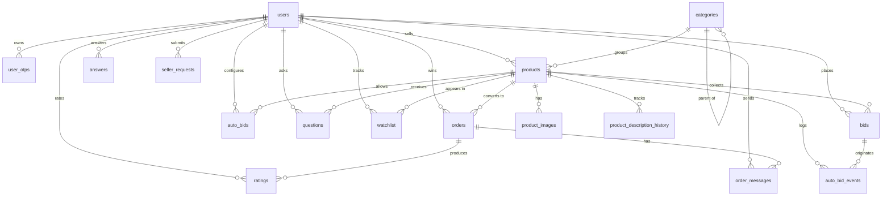

**users**
- id PK
- email UNIQUE
- password_hash
- full_name
- phone_number
- address
- role ENUM('ADMIN','SELLER','BIDDER')
- positive_score DEFAULT 0
- negative_score DEFAULT 0
- status ENUM('CREATED','CONFIRMED','SUSPENDED')
- created_at TIMESTAMPTZ
- updated_at TIMESTAMPTZ

**user_otps**
- id PK
- user_id FK → users.id
- code
- purpose ENUM('REGISTER','RESET_PASSWORD')
- expires_at TIMESTAMPTZ
- consumed_at TIMESTAMPTZ NULLABLE
- created_at TIMESTAMPTZ

**categories**
- id PK
- name
- parent_id FK → categories.id NULLABLE
- created_at TIMESTAMPTZ
- updated_at TIMESTAMPTZ

**products**
- id PK
- seller_id FK → users.id
- category_id FK → categories.id
- name
- slug UNIQUE
- description
- start_price BIGINT
- price_step BIGINT
- current_price BIGINT
- buy_now_price BIGINT NULLABLE
- auto_extend BOOLEAN DEFAULT true
- enable_auto_bid BOOLEAN DEFAULT true
- current_bidder_id FK → users.id NULLABLE
- bid_count INTEGER DEFAULT 0
- highlight_until TIMESTAMPTZ NULLABLE
- status ENUM('ACTIVE','ENDED','REMOVED')
- start_at TIMESTAMPTZ
- end_at TIMESTAMPTZ
- created_at TIMESTAMPTZ
- updated_at TIMESTAMPTZ

**product_images**
- id PK
- product_id FK → products.id
- image_url
- display_order INTEGER DEFAULT 0
- created_at TIMESTAMPTZ

**bids**
- id PK
- product_id FK → products.id
- user_id FK → users.id
- bid_amount BIGINT
- is_auto_bid BOOLEAN DEFAULT false
- created_at TIMESTAMPTZ

**auto_bids**
- id PK
- product_id FK → products.id
- user_id FK → users.id
- max_bid_amount BIGINT
- created_at TIMESTAMPTZ
- updated_at TIMESTAMPTZ
- UNIQUE (product_id, user_id)

**auto_bid_events**
- id PK
- product_id FK → products.id
- auto_bid_id FK → auto_bids.id NULLABLE
- bid_id FK → bids.id NULLABLE
- event_type ENUM('PLACE','OUTBID','RECALCULATE')
- previous_bidder_id FK → users.id NULLABLE
- new_bidder_id FK → users.id NULLABLE
- triggered_at TIMESTAMPTZ

**settings**
- id PK
- key UNIQUE
- value
- description
- created_at TIMESTAMPTZ
- updated_at TIMESTAMPTZ

**watchlist**
- id PK
- user_id FK → users.id
- product_id FK → products.id
- created_at TIMESTAMPTZ

**questions**
- id PK
- product_id FK → products.id
- user_id FK → users.id
- question_text
- created_at TIMESTAMPTZ

**answers**
- id PK
- question_id FK → questions.id
- user_id FK → users.id
- answer_text
- created_at TIMESTAMPTZ

**seller_requests**
- id PK
- user_id FK → users.id
- status ENUM('PENDING','APPROVED','REJECTED')
- requested_at TIMESTAMPTZ
- expire_at TIMESTAMPTZ
- processed_at TIMESTAMPTZ NULLABLE

**orders**
- id PK
- product_id FK → products.id
- seller_id FK → users.id
- winner_id FK → users.id
- final_price BIGINT
- status ENUM('PENDING_PAYMENT','PROCESSING','COMPLETED','CANCELLED')
- created_at TIMESTAMPTZ
- updated_at TIMESTAMPTZ

**order_messages**
- id PK
- order_id FK → orders.id
- sender_id FK → users.id
- message
- created_at TIMESTAMPTZ

**ratings**
- id PK
- order_id FK → orders.id
- rater_id FK → users.id
- rated_user_id FK → users.id
- score SMALLINT CHECK (score IN (1, -1))
- comment
- created_at TIMESTAMPTZ
- UNIQUE (order_id, rater_id)

**product_description_history**
- id PK
- product_id FK → products.id
- content_added
- created_at TIMESTAMPTZ

**bid_blacklist**
- id PK
- product_id FK → products.id
- user_id FK → users.id
- reason
- created_at TIMESTAMPTZ
```
