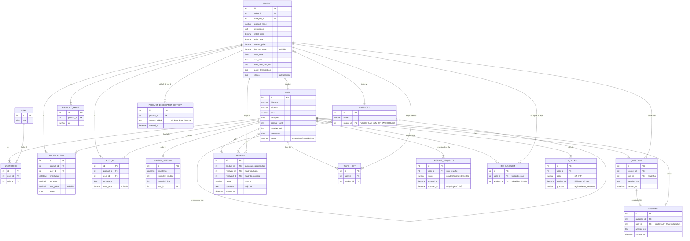

```mermaid
erDiagram
    USER ||--|{ USER_ROLE : "có"
    ROLE ||--|{ USER_ROLE : "thuộc về"
    
    PRODUCT ||--|{ PRODUCT_IMAGE : "có"
    PRODUCT }o--|| CATEGORY : "thuộc về"
    PRODUCT }o--|| USER : "bán bởi"

    PRODUCT ||--|{ BIDDER_ACTION : "có"
    USER ||--|{ BIDDER_ACTION : "thực hiện"

    PRODUCT ||--|{ AUTO_BID : "có"
    USER ||--|{ AUTO_BID : "cài đặt"

    USER ||--|{ SYSTEM_SETTING : "quản lý"
    
    USER {
        int id PK
        varchar fullname
        varchar address
        varchar email 
        date birth_date
        int positive_point
        int negative_point
        date timestamp
        varchar status "created/confirmed/deleted"
    }
    
    USER_ROLE {
        int id PK
        int user_id FK
        int role_id FK
    }
    
    ROLE {
        int id PK
        char role
    }
    
    CATEGORY {
        int id PK
        varchar name
        int parent_id FK "nullable, tham chiếu đến CATEGORY(id)"
    }
    
    PRODUCT_IMAGE {
        int id PK
        int product_id FK
        varchar url
    }
    
    BIDDER_ACTION {
        int id PK
        int product_id FK
        int user_id FK
        datetime timestamp
        decimal bid_price
        decimal max_price "nullable"
        char bidder
    }
    
    PRODUCT {
        int id PK 
        int seller_id FK
        int category_id FK
        varchar product_name 
        text description 
        decimal initial_price 
        decimal price_step
        decimal current_price
        decimal buy_out_price "nullable" 
        date start_time
        date end_time
        bool new_user_can_bid
        bool point_threshold_on
        bool status "active/ended"
    }
    
    AUTO_BID {
        int id PK
        int product_id FK
        int user_id FK
        date timestamp
        decimal max_price "nullable" 
    }
    
    SYSTEM_SETTING {
        int id PK
        datetime timestamp
        int extended_window
        int extended_time
        int user_id FK
    }
    QUESTIONS {
        int id PK
        int product_id FK
        int user_id FK "người hỏi"
        text question_text
        datetime created_at
    }
    
    ANSWERS {
        int id PK
        int question_id FK
        int user_id FK "người trả lời (thường là seller)"
        text answer_text
        datetime created_at
    }

    REVIEWS {
        int id PK
        int product_id FK "sản phẩm của giao dịch"
        int reviewer_id FK "người đánh giá"
        int reviewed_id FK "người bị đánh giá"
        smallint rating "+1 or -1"
        text comment "nhận xét"
        datetime created_at
    }

    WATCH_LIST {
        int id PK
        int user_id FK
        int product_id FK
    }

    UPGRADE_REQUESTS {
        int id PK
        int user_id FK "user yêu cầu"
        varchar status "pending/approved/rejected"
        datetime created_at
        datetime updated_at "ngày duyệt/từ chối"
    }

    PRODUCT_DESCRIPTION_HISTORY {
        int id PK
        int product_id FK
        text content_added "nội dung được thêm vào"
        datetime created_at
    }

    BID_BLACKLIST {
        int id PK
        int user_id FK "bidder bị chặn"
        int product_id FK "sản phẩm bị chặn"
    }

    OTP_CODES {
        int id PK
        int user_id FK
        varchar code "mã OTP"
        datetime expires_at "thời gian hết hạn"
        varchar purpose "register/reset_password"
    }

    %% --- Định nghĩa các mối quan hệ ---
    
    CATEGORY }o--o{ CATEGORY : "có danh mục con"

    USER ||--|{ QUESTIONS : "hỏi"
    PRODUCT ||--|{ QUESTIONS : "có câu hỏi"
    
    QUESTIONS ||--|{ ANSWERS : "có câu trả lời"
    USER ||--|{ ANSWERS : "trả lời"

    USER ||--|{ REVIEWS : "viết"
    USER ||--|{ REVIEWS : "nhận"
    PRODUCT ||--|{ REVIEWS : "thuộc về"

    USER ||--|{ WATCH_LIST : "theo dõi"
    PRODUCT ||--|{ WATCH_LIST : "được theo dõi"

    USER ||--|{ UPGRADE_REQUESTS : "yêu cầu nâng cấp"
    
    PRODUCT ||--|{ PRODUCT_DESCRIPTION_HISTORY : "có lịch sử mô tả"
    
    USER ||--|{ BID_BLACKLIST : "bị chặn khỏi"
    PRODUCT ||--|{ BID_BLACKLIST : "có người bị chặn"
    
    USER ||--|{ OTP_CODES : "sở hữu"
```
    
    